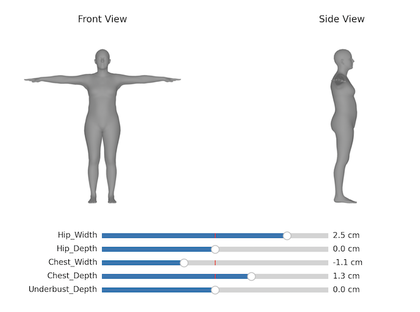

# LocalSMPL

This repository contains code for local, measurement-based control of SMPL body shapes.
This may be useful for 3D body shape estimation and controllable 3D avatar generation.

Further details can be found in the paper:  
**Probabilistic Estimation of 3D Human Shape and Pose with a Semantic Local Parametric Model**  
[Akash Sengupta](https://akashsengupta1997.github.io/), [Ignas Budvytis](http://mi.eng.cam.ac.uk/~ib255/), [Roberto Cipolla](https://mi.eng.cam.ac.uk/~cipolla/)  
BMVC 2021  
[[paper+supplmentary]](https://arxiv.org/abs/2111.15404)  




## Installation
First clone the repository:
``` bash
git clone https://github.com/akashsengupta1997/LocalSMPL
```
We recommend using a virtual environment to install relevant dependencies:
``` bash
python3 -m venv LocalSMPL_env
source LocalSMPL_env/bin/activate
```
Install the dependencies:
``` bash
pip install -r requirements.txt
``` 

### Download SMPL
Download the neutral, male and female SMPL model files from [here](https://smpl.is.tue.mpg.de/).
**Please ensure that you download version 1.1.0 with 300 shape PCs!**  
You will need to make the SMPL model files compatible with Python 3 by removing any Chumpy objects. 
To do so, please follow the instructions [here](https://github.com/vchoutas/smplx/tree/master/tools).  
Then, rename and place the SMPL model files in the `models` directory, which should have the following structure:

    LocalSMPL
    ├── models                           # Folder with model files
    │   ├── smpl_300
    │   │   ├── SMPL_NEUTRAL.pkl              # Gender-neutral SMPL model with 300 PCs
    │   │   ├── SMPL_MALE.pkl                 # Male SMPL model with 300 PCs
    │   │   └── SMPL_FEMALE.pkl               # Female SMPL model with 300 PCs
    │   ├── meas2betas 
    │   │   ├── meas2betas_neutral.pkl        # Gender-neutral measurements to SMPL regressor
    │   │   ├── meas2betas_male.pkl           # Male measurements to SMPL regressor
    │   │   └── meas2betas_female.pkl         # Female measurements to SMPL regressor
    └── ...

If the files are placed elsewhere, you will need to update `configs/paths.py` accordingly.

## Demo
Local, measurement-based control of SMPL body shape is achieved using a simple measurements-to-betas regression model.
This provides a linear mapping from measurement offsets (e.g. `+3cm Chest_Width`) to SMPL beta offsets.
New SMPL betas are obtained as:
```
new_betas = orig_betas + torch.matmul(meas_deltas, meas2betas_model)
```

`slider.py` provides an interactive visualisation of measurement-based shape control.
Try manipulating the sliders after running:
```bash
python slider.py --measurements Hip_Width Hip_Depth Chest_Width Chest_Depth Underbust_Depth
```
Please ensure that you are using an appropriate backend for Matplotlib.
If the visualisation is running slowly, 
append `--no_render` to the above command to replace rendering with a point-based visualisation.
This will also visualise the definitions of different measurements.

The list of measurements that can be manipulated is: 
`Hip_Width, Hip_Depth, Chest_Width, Chest_Depth, Underbust_Depth, Abdomen_Width, 
Abdomen_Depth, Stomach_Width, Stomach_Depth, Calf_Circum, Lower_Thigh_Circum, Upper_Thigh_Circum, 
Upper_Arm_Circum, Forearm_Circum, Neck_Circum, Thigh_Length, Calf_Length, Arm_Length, Torso_Length, 
Shoulder_Width, Head_Width, Head_Height, Head_Depth`.

Set `--gender` to `male` or `female` to visualise local control of gendered SMPL bodies.

In addition, you may vary the base SMPL shape (`orig_betas`).
We provide two pre-defined alternative base shapes as examples - set `--base_shape` to `1` or `2`.

## Weaknesses and Future Research
The following aspects of our method may be the subject of future research:
- A linear mapping from measurements to SMPL betas may be too simple to provide precise localised control. This is apparent when using measurement offsets >5cm. Learned non-linear mappings may be more useful.
- A denser set of measurements may need to be defined to provide better coverage of the SMPL body.

## Citation
If you find this code useful in your research, please cite the following publication:
```
@InProceedings{sengupta2021localsmpl,
               author = {Sengupta, Akash and Budvytis, Ignas and Cipolla, Roberto},
               title = {{Probabilistic Estimation of 3D Human Shape and Pose with a Semantic Local Parametric Model}},
               booktitle = {BMVC},
               year = {2021}                         
}
```
